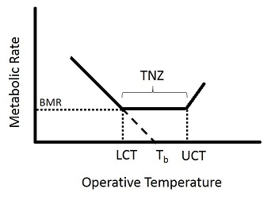

Using published and unpublished data from Dr. Don Powers' earlier work, I construct here a preliminary energy budget for a North American species, the Broad-billed hummingbird (BBLH; *Cynanthus latirostris*).

1.  Basal Metabolic Rate
------------------------------
Basal metabolic rate is the minimum metabolic rate required for survival. It includes basic body upkeep, and does not include thermoregulation, digestive costs, or any activity costs. The basal metabolic rate measurements here are based on a regression of metabolic rates measured under basal metabolic conditions over a range of temperatures (in the dark, fasted, during the sleep phase; measured during summer 2012, n = 8).

Mean BMR~BBLH~ = 0.2385 mL/min (4.8 J/min; 0.0799W; where MR of 1 ml/min = 20.1 Joules/min. 1 Watt is 1 Joule/second)

The assumptions of these measurements are:  
  -  32&deg;C is the lower critical temperature for the Broad-billed hummingbird, and represents the lowest temperature for measurement of the basal metabolic rate. A lower critical temperature of 32&deg;C is consistent with measurements for a number of other hummingbirds (Lasiewski 1963, Lasiewski & Lasiewski 1967, Hiebert 1990, Lopez-Calleja & Bozinovic 1995) and data on Costa's Hummingbirds (*Calypte costae*) and broad-tailed hummingbirds (*Selasphorus platycercus*; unpublished, Donald R. Powers).  
 -  Basal metabolism is assumed as a continuous cost for 24 hours except when birds use torpor.  If torpor is used then BMR is a continuous cost for 24 hours, excluding the hours spent in torpor.  Torpor was used for a maximum of four hours at the Sonoita Creek site where these Broad-billed hummingbirds were studied.
 
2.  Thermoregulation
---------------------
The thermoneutral zone (TNZ) is the optimum range of ambient temperatures over which there are no regulatory changes in metabolic heat production or evaporative heat loss (Kingma et al. 2012). Thermoregulatory costs are calculated separately below and above the TNZ, as the slopes are different and asymmetric for these two regions, as seen in Figure 1 (Lasiewski 1963).  

\centering

\flushleft

**Figure 1**: The thermoneutral zone (TNZ). T~b~ = Body temperature; LCT = Lower critical temperature; UCT = Upper critical temperature; BMR = Basal metabolic rate

&nbsp;&nbsp;**A.  Below the TNZ** (Operative temperature T~e~ < 32&deg;C)  

First, hourly averages for metabolic rate across a range of temperatures below the TNZ were measured under basal conditions (as described for BMR measurements) in the summer of 2012. Operative temperature data was collected from the landscape using copper spheres. By regressing metabolic rate on temperature below the lower critical temperature, the following equation is obtained:  

MR~L~ (mL  O~2~/min) = 0.9530 - 0.0223\*(T~e~) &nbsp;&nbsp;&nbsp;&nbsp;&nbsp;&nbsp;-**Equation 1a**

Here, MR~L~ is metabolic rate when T~e~ < 32&deg;C. I then calculate TRE~L~, which is the sum of the hourly averages of MR~L~ for all hours where mean T~e~ < lower critical temperature. Thermoregulatory costs alone can be calculated by subtracting BMR from the result of equation 1a, but as time spent thermoregulating will always involve basal metabolic costs, TRE~L~ includes both basal metabolic costs and thermoregulatory costs.

TRE~L~ (kJ) = $\Sigma$(MR~L~ \* 60) &nbsp;&nbsp;&nbsp;&nbsp;&nbsp;&nbsp;- **Equation 1b**

Thus, the hourly average MR~L~ is multiplied by 60 to convert it to a per-hour metabolic rate. The sum of the per-hour metabolic rates over 24 hours then yield TRE~L~, which is the daily energy spent on thermoregulation and basal metabolism below the TNZ. Torpor was assumed to be zero because birds rarely entered torpor in Sonoita Creek.

&nbsp;&nbsp;**B.  Above the TNZ** (T~e~ > 35&deg;C)  

Lasiewski's (1963) data suggests that the upper critical temperature for small hummingbirds is ~35-37 &deg;C. The only data I know of for metabolic rate above the upper critical temperature in small hummingbirds are Powers' unpublished data on Costa's. These data also show an upper critical temperature of 35&deg;C. The slope of the relationship below was based on unpublished measurements of Costa's Hummingbird (*Calypte costae*), a similarly sized species. The Y intercept of this equation was obtained by substituting the Broad-billed hummingbird's BMR and an operative temperature of 35&deg;C into the Costa's regression equation.

MR~H~ (mL O~2~/min) = 0.214 (T~e~) - 7.2515 &nbsp;&nbsp;&nbsp;&nbsp;&nbsp;&nbsp;- **Equation 2a**

Where MR~H~ is metabolic rate at temperatures above upper critical temperature. Thermoregulatory costs above the upper critical temperature can be calculated by subtracting BMR from the result of equation 2a.  Again, the result of equation 2a is the combined cost of BMR and thermoregulation as time spent thermoregulating will also always include BMR.

TRE~H~ (kJ) = $\Sigma$(MR~H~ \* 60) &nbsp;&nbsp;&nbsp;&nbsp;&nbsp;&nbsp;- **Equation 2b**

TRE~H~ is calculated as the sum of hourly averages for all hours where mean T~e~ > upper critical temperature, again assuming no torpor use.

3.  Activity Costs
------------------
&nbsp;&nbsp;**A.  Resting (perching)**  

Little data are available for how much resting metabolic rate (RMR) is elevated above BMR in hummingbirds.  An Aschoff & Pohl study (1970) reported data for several bird species suggesting RMR = 1.25 x BMR. The Aschoff & Pohl correction has often been used to estimate RMR but might underestimate true resting costs because the measurements upon which it is based were typically made on birds resting in the dark.  This would eliminate any costs associated with response to light or surrounding events.  Further, Aschoff & Pohl fasted birds so the cost of specific dynamic action (i.e. the cost of digestion; SDA) is also not included.  Two years ago Powers made RMR measurements on Calliope hummingbirds (*Selasphorus calliope*; ~2.4 g) on a perch in an illuminated chamber.  After subtracting thermoregulatory costs RMR~Calliope~ = 0.2835 mL O~2~/min.  BMR~Calliope~ = 0.1843 mL O~2~/min (Lasiewski 1963).  Thus,  

  RMR~Calliope~ = 1.54 x BMR

This is likely to more accurately reflect the metabolic rate of a perching hummingbird in the wild.  Thus, I can estimate RMR as:
  
  RMR = 1.5 x BMR &nbsp;&nbsp;&nbsp;&nbsp;&nbsp;&nbsp;- **Equation 3**

This is a fair relationship to use for broad- billed hummingbirds, as Calliope and Broad-billed hummingbirds are about the same weight (both around 3g), are behaviorally similar and perch in similar environments. Thus,  
  
  RMR~BBLH~ = `r 1.5*(0.2385)` ml/min (7.1908J/min; 0.1198W)

&nbsp;&nbsp;**B.  Hovering**  

Powers has measured hovering metabolic rates (HMR) in Broad-billed hummingbirds. I use only the upper two-third of these measurements, as the method was biased to underestimate HMR. Mean HMR~BBLH~ = 2.4 mL O~2~/min.

Going from these values and from past studies (Fernandez et al. 2011), we know that HMR is:  

  HMR~BBLH~ = 10.3 x BMR

&nbsp;&nbsp;**C.  Forward flight**  

No measurements have been made on the metabolic cost of forward flight (FLMR) in Broad-billed hummingbirds. Assuming that hummingbirds fly most often at their most efficient speed (6-8 m/s), FLMR can be estimated using data from other hummingbird species. These relationships are well-established from studies on power curves in hummingbirds (Tobalske et al. 2003, 2010).

FLMR~Calliope~ = 0.53 x HMR

FLMR~Rufous~ = 0.49 x HMR

Thus, I can estimate FLMR for Broad-billed hummingbirds to be:
  
  FLMR = 0.5 x HMR &nbsp;&nbsp;&nbsp;&nbsp;&nbsp;&nbsp;- **Equation 4**
  
  FLMR~BBLH~ = 0.5*2.1 ml/min = 1.05 ml/min (21.11 J/min; 0.3518W)

&nbsp;&nbsp;**D.  Total activity costs**  

ACT = ((Time~RMR~ \* (RMR - BMR)) + (Time~HMR~ \* (HMR - BMR) + (Time~FLMR~ \* (FLMR - BMR)										 &nbsp;&nbsp;&nbsp;&nbsp;&nbsp;&nbsp;- **Equation 5**
                                                      
4.  Nighttime Energy Expenditure 
----------------------------
There is a large amount of individual and daily variation in the frequency and duration of torpor use. For the sake of modeling DEE I assume that either torpor is not used at all, or if torpor is used, it is used to the full extent observed at the site.  By doing so I can create upper and lower energetic boundaries based on whether or not torpor was used. As it is difficult to predict the frequency and duration of torpor use for any given individual, having upper and lower bounds is more useful for the energy budget than using a continuous variable of torpor use.  

&nbsp;&nbsp;**A.  No torpor**  
When no torpor is used, nighttime energy expenditure (NEE) comprises BMR and the cost of thermoregulation below the lower critical temperatures (i.e. TRE~L~).  Thus, NEE for normothermic hummingbirds can be calculated using equation 1a and nighttime temperature data. NEE calculated this way can be verified to be the same as nighttime energy expenditure data measured from birds which did not use torpor at all.

&nbsp;&nbsp;**B.  Torpor**  
For birds that used torpor maximally last summer, total nighttime energy expenditure was measured as:
  
  Nighttime energy expenditure (NEE) = 2 kJ

Note:  This value can change slightly as I refine the calculations.  Even so, this is such a small component of DEE that small changes to this value will have little impact on model results.

5.  DEE Model
-------------
**DEE = BMR + (TRE~L~ + TRE~H~) + ACT + NEE**  

Where:  
DEE = Daily energy expenditure  
BMR = Basal metabolic rate for time spent within the TNZ  
TRE~L~ = Metabolic rate below lower critical temperature (including thermoregulation and BMR)  
TRE~H~ = Metabolic rate above higher critical temperature (including thermoregulation and BMR)  
ACT = Activity costs (from above)  
NEE = Nighttime energy expenditure   
Note:  If no torpor is used then NEE = 0, and NEE is included in TRE~L~. If the species had a broader TNZ, BMR for time spent in the TNZ would be included as an additional term (thermoregultory costs would be 0).

**Model test using Sonoita Creek _C. latirostris_ values**

Here, assuming:  
  
1.  70% of the daytime was spent resting and 30% flying.  Flying was 50% hovering and 50% forward flight [**add citations**].  
  
2.  No torpor (this is realistic for Sonoita Creek).  
  
3.  Respiratory quotient (RQ) = 0.85 (for conversion of oxygen consumption to CO~2~ production)  
  
4.  14/10 photoperiod.  

**Calculation of Results:**

``` {r}
## Energy Budget for Broad-billed hummingbirds
## Anusha Shankar, January 21, 2015

## Thermoregulatory equations
## tre_h = 0.0144*Te - 0.2655; intercept obtained by substituting BMR_BBLH
## in equation with Costa's slope, and UCT = 35&deg;C
## tre_l = 0.9530 - 0.0223*Te, assuming LCT is 32&deg;C
## Body temperature can be obtained by taking the X intercept from the tre_l equation   
library(reshape)

## Set wd and read in file
setwd("C:\\Users\\ANUSHA\\Dropbox\\Anusha_personal\\Thesis proposal\\R_csv\\AZ")
sc_temp <- read.csv("SonoitaCreek_Temperatures_S1.csv")

## Melt
m.sc <- melt(sc_temp, id.vars = c("Time", "Mean_Ta"), measure.vars = "MR_ml.h")
m.sc <- m.sc[,c(1,2,4)]
names(m.sc) <- c("Time", "Mean_Ta", "MR_ml_h" )

## DEE = BMR + (TRE_L + TRE_H) + ACT + NEE

## Basal metabolic rate for time spent within the TNZ in 14 daytime hours (5am-7pm)
t_bmr <- sum(m.sc$MR_ml_h[32 < m.sc$Mean_Ta & m.sc$Mean_Ta < 35 & 4 < m.sc$Time & m.sc$Time < 20])

## TRE_H from SC 14-hour temperature data and broad-bill equation
tre_h <- sum(m.sc$MR_ml_h[m.sc$Mean_Ta > 35 & 4 < m.sc$Time & m.sc$Time < 20])

## TRE_L from SC 14-hour temperature data and broad-bill equation
tre_l <- sum(m.sc$MR_ml_h[m.sc$Mean_Ta < 32 & 4 < m.sc$Time & m.sc$Time < 20])

## Total energy spent on BMR + thermoregulation in 14 daytime hours
tre_total <- tre_h + tre_l + t_bmr

## Nighttime energy expenditure in ml O2/h from broad-bill data, 10 hour night (7pm-5am)
nee <- sum(m.sc$MR_ml_h[m.sc$Time < 5 | m.sc$Time > 18])

## Metabolic rates in ml O2/h
bmr <- 0.2385*60
rmr <- 1.5*bmr
hmr <- 10.3*bmr
flmr <- 0.5*hmr

## Total energy spent on daytime activities in ml O2/h. 
## Assuming ACT = 70% resting + 20% hovering + 10% flying; 14 daylight hours
ACT <- (0.7*14*(rmr-bmr)) + (0.2*14*(hmr-bmr)) + (0.1*14*(flmr-bmr))

## Model estimate in ml O2 per 24h
DEE_model <- tre_total + ACT + nee

## To get a per hour CO2 estimate, I multiply by RQ (assumed to be 0.85) and divide by 24
DEE_model_hr <- DEE_model*0.85/24

## Measured estimate of DEE from DLW
dlw <- 51.3

## Percentage the model is off from the mean DLW estimate
per.off <- ((dlw - DEE_model_hr)/dlw)*100

```

Mean Measured DEE (DLW) = 51.3 $\pm$ 6.6 mL CO~2~/h (range 39.5-58.6)  
  
Model Estimate = `r DEE_model_hr ` CO~2~/h  
  
The model estimate is `r per.off`% lower than the measured value. I am encouraged by this considering that this model is likely biased low since costs of agonistic behavior and reproduction (mating displays, increased territoriality) are not specifically considered, and since the higher thermoregulatory slope is taken from a desert-adapted species (*Calypte costae*).